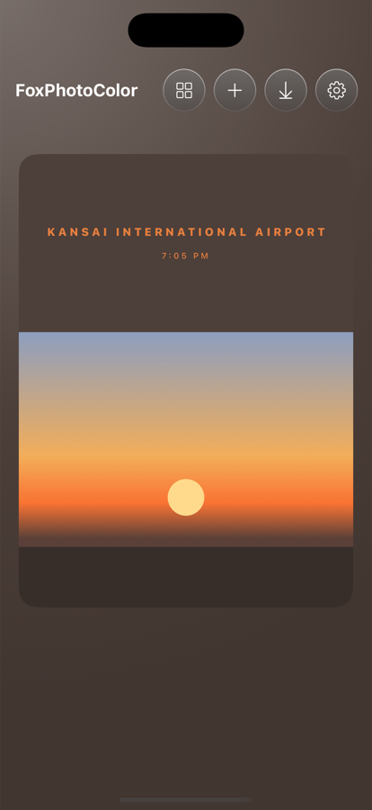
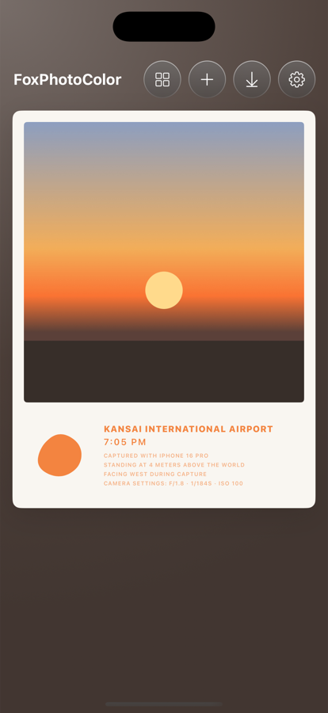
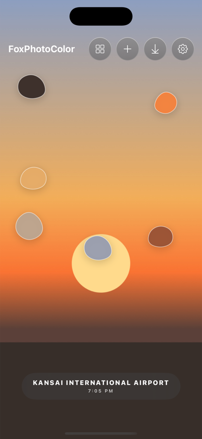
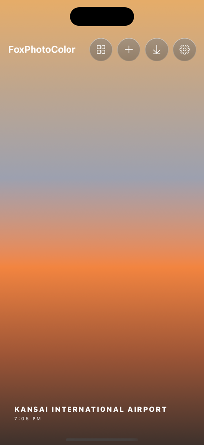
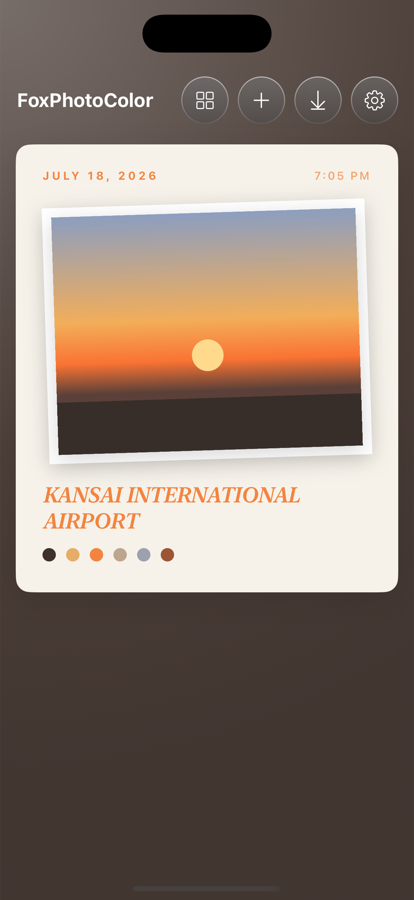
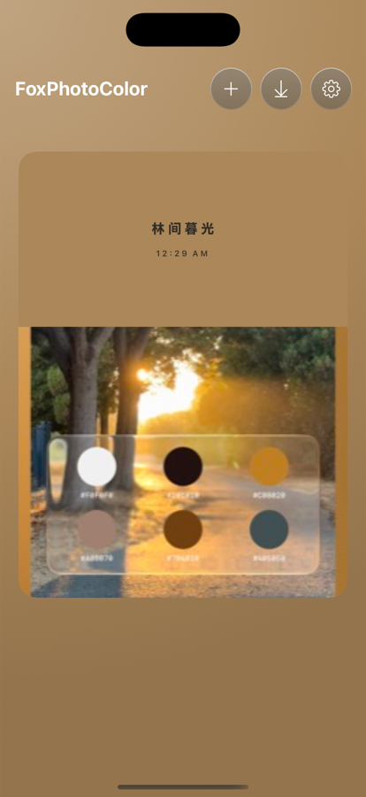
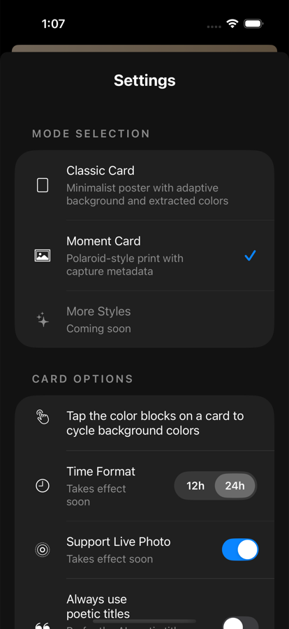

# FoxPhotoColor 🦊

**Turn any photo into a minimalist color-palette poster.**
Pick a photo → k-means extracts its dominant colors → get a poster you can restyle, retitle, and share. Built with SwiftUI for iOS 17+.

一款把照片变成极简色卡海报的 iOS App:选照片 → 提取主色 → 生成海报,支持五种海报模式、AI 诗意命名、气泡拖拽与一键分享。

<p align="center">
  
  
  
  
  
</p>

## Features

- **Five poster modes** — Classic poster, Moment Card (polaroid with EXIF camera metadata), Bubble Stamp (draggable palette bubbles with an organic "breathing" wobble), Spectrum Wallpaper (full-screen gradient from the palette), and Magic Journal (scrapbook page). Switch from Settings; the choice persists.
- **AI poetic titles** — a downscaled copy of the photo is sent to an Anthropic-compatible vision endpoint which names the card ("Golden Hour Lane", 「林间暮光」). Fallback chain: GPS place name → AI title → default. Fully optional; the app works offline.
- **On-device color pipeline** — deterministic k-means palette extraction (12 MP in ~0.05 s), perceptual-luminance-aware accent pairing, tap the card to cycle backgrounds through the palette.
- **EXIF-aware** — capture time, GPS reverse-geocoded place names ("Golden Gate Park · San Francisco"), camera model / aperture / shutter / ISO / altitude / heading rendered on the Moment Card. Reads image bytes directly; no photo-library permission needed.
- **Fluid interactions** — swipe-up to delete with momentum projection and 5 s undo, drag-to-crop, drag bubbles (positions persist), Live Photo long-press playback, haptics at every commit point. Honors Reduce Motion.
- **Share anywhere** — download renders the poster exactly as displayed and opens the share sheet directly.
- **Widgets** — home screen (small/medium) and lock screen (rectangular) widgets that deep-link back to their card.
- **Localized** — Simplified Chinese + English, enforced by a CI-able catalog checker.

<p align="center">
  
  
</p>

## Building

Requires Xcode 16+ (project uses `objectVersion 77` with filesystem-synchronized groups — files added under `FoxPhotoColor/` join the target automatically).

```bash
scripts/harness.sh build          # xcodebuild → build/
scripts/harness.sh run --seed     # install into an iPhone 16 Pro simulator with seeded demo cards
scripts/harness.sh capture NAME   # screenshot → artifacts/NAME.png
scripts/harness.sh all --seed     # build + run + capture
```

The `--seed` flag (`FPC_SEED=1`) generates three synthetic photos through the full extraction pipeline, so every screen is reachable headlessly — no photo picker taps required. More QA hooks (`FPC_MODE`, `FPC_IMPORT`, `FPC_EXPORT`, `FPC_CLEAR`, …) are listed in `CLAUDE.md`.

### AI titles (optional)

Point the app at any Anthropic-Messages-compatible endpoint:

| Env var | Default | Purpose |
|---|---|---|
| `FPC_AI_BASE_URL` | `http://127.0.0.1:8317` | Endpoint base (`/v1/messages` is appended) |
| `FPC_AI_KEY` | *(empty)* | `x-api-key` header, omitted when empty |
| `FPC_AI_MODEL` | `claude-opus-4-8` | Vision-capable model id |

When the endpoint is unreachable the app quietly falls back — and retries naming untitled cards on the next launch.

## Testing

```bash
scripts/test-palette.sh    # 18 assertions inside the simulator: determinism, luminance gaps, JSON round-trip, 12 MP perf gate
scripts/test-metadata.sh   # EXIF/GPS parser self-check
scripts/check-i18n.sh      # both string catalogs: zh/en completeness, missing references, orphan keys
```

## Architecture notes

- **No database** — cards persist as `Documents/FoxPhotoColor/cards.json` + original image bytes (kept verbatim so Live Photo pairing survives relaunches).
- **Poster = the app itself** — `PosterView` re-renders the on-screen composition (any mode) through `ImageRenderer` for export, so what you share is what you saw.
- **Normalized geometry** — bubble positions and crop offsets store in unit space, making cards device-size independent (iPhone ↔ iPad).
- iPad runs the same portrait poster canvas, capped at 560 pt and centered.

## License

[MIT](LICENSE) © 2026 Sma1lboy
